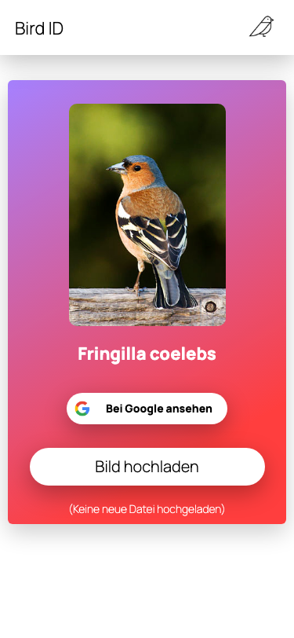
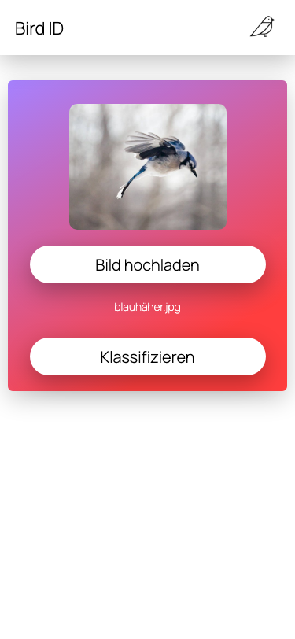
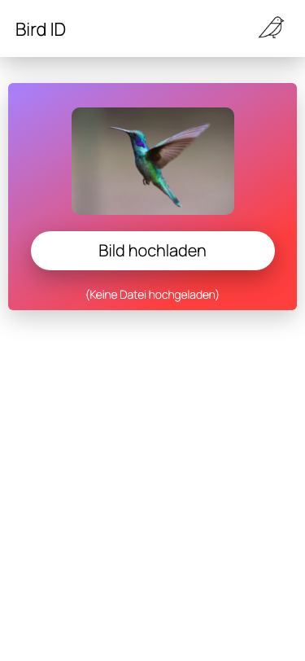

# Front-end for Bird ID
This is a little GUI for image classification tasks. 

### Compiles and hot-reloads for development
```
npm run serve
```

### Compiles and minifies for production
```
npm run build
```

### Lints and fixes files
```
npm run lint
```

### Customize configuration
See [Configuration Reference](https://cli.vuejs.org/config/).

# Preview

<br>
<br>
<br>
<p align="center">
  
  
  
</center>
<br>
<br>
<br>
